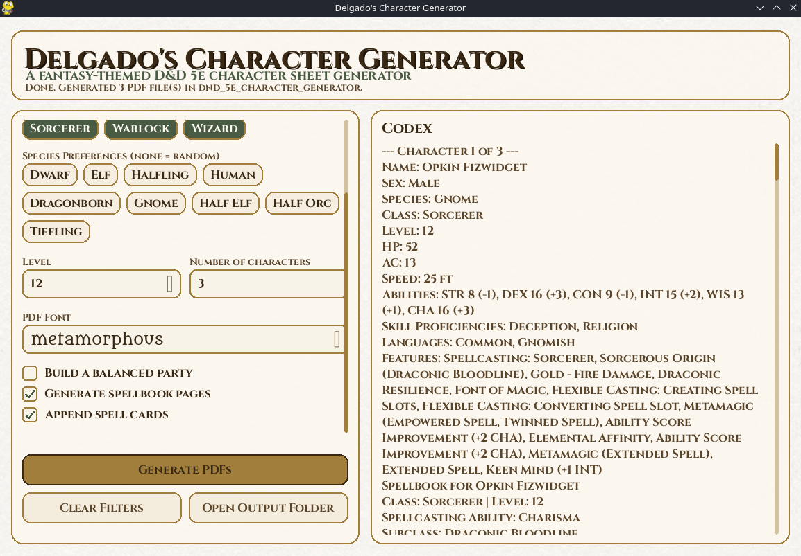

# D&D 5e Character Generator (`DnD-5e-Character-Generator`)

A toolkit for generating random, rules-legal D&D 5th Edition characters (levels 1-20) and outputting filled PDF character sheets with fantasy fonts.

## Documentation

- [Documentation index](docs/README.md)
- [GUI usage guide](docs/GUI_USAGE.md)
- [CLI usage guide](docs/CLI_USAGE.md)
- [GUI assets and credits](docs/GUI_ASSETS.md)

## Disclaimer

I'm in no way affiliated with Wizard of the Coast or Dungeons and Dragons. This is a hobby project. The character sheets are downloaded from an official source upon character creation, and I do not own that file. In the future, I may setup my own character sheets to avoid confusion.

Spell cards work, but they're not the prettiest yet, revisions will happen at some point, but I don't know when. Core functionality should be completed though.


## Setup

### Requirements

- Python 3.10+

### Installation

```bash
git clone https://github.com/pyrometheous/DnD-5e-Character-Generator.git
cd DnD-5e-Character-Generator
pip install -r requirements.txt
```

## GUI Usage

The desktop GUI launcher is `main.pyw`.

Screenshot:



### Linux

```bash
python3 main.pyw
```

### macOS

```bash
python3 main.pyw
```

### Windows

```powershell
py main.pyw
```

You can also double-click `main.pyw` in Explorer if `.pyw` is associated with Python.

For more detail, see [GUI usage guide](docs/GUI_USAGE.md).

## CLI Usage

```bash
python3 main.py [OPTIONS]
```

Running with no arguments generates a single character with a random class, species, level, and font.

### Arguments

| Argument | Type | Default | Description |
|---|---|---|---|
| `--level` | int (1–20) | Random | Character level. |
| `--class` | string | Random | Character class or comma-separated class list. |
| `--species` | string | Random | Character species/race or comma-separated species list. |
| `--font` | string | Random | Fantasy font for the PDF. |
| `--characters` | int | 1 | Number of characters to generate. |
| `--balance` | flag | Off | Build a theoretically balanced party for the requested group size. |
| `--spellbook` | flag | Off | Populate page 3 of the PDF with a random, redundancy-aware spellbook for spellcasting classes. |
| `--spellcards` | flag | Off | Append 3x5 spell card pages for spellcasting characters. |

### Valid Values

**Classes:** `barbarian`, `bard`, `cleric`, `druid`, `fighter`, `monk`, `paladin`, `ranger`, `rogue`, `sorcerer`, `warlock`, `wizard`

**Species:** `Dwarf`, `Elf`, `Halfling`, `Human`, `Dragonborn`, `Gnome`, `Half_elf`, `Half_orc`, `Tiefling`

**Fonts:**

| Font | Description |
|---|---|
| [`cinzel`](https://fonts.google.com/specimen/Cinzel) | Elegant serif, great readability |
| [`medievalsharp`](https://fonts.google.com/specimen/MedievalSharp) | Whimsical medieval script |
| [`almendra`](https://fonts.google.com/specimen/Almendra) | Fantasy serif inspired by calligraphy |
| [`metamorphous`](https://fonts.google.com/specimen/Metamorphous) | Dark fantasy display font |
| [`pirataone`](https://fonts.google.com/specimen/Pirata+One) | Pirate/adventure theme |
| [`imfell`](https://fonts.google.com/specimen/IM+Fell+English+SC) | Historic English printing style |
| [`uncialantiqua`](https://fonts.google.com/specimen/Uncial+Antiqua) | Celtic/uncial manuscript style |

### Examples

```bash
# Generate a single random character
python3 main.py

# Level 1 Human Fighter with a specific font
python3 main.py --level 1 --class fighter --species Human --font cinzel

# 5 level-1 characters with random classes and species
python3 main.py --level 1 --characters 5

# A balanced 5-person level-10 party
python3 main.py --level 10 --characters 5 --balance

# A balanced party built around a fighter and wizard
python3 main.py --level 8 --characters 4 --balance --class fighter,wizard

# A level-10 wizard with a random spellbook
python3 main.py --class wizard --level 10 --spellbook

# A level-10 wizard with appended spell cards
python3 main.py --class wizard --level 10 --spellcards --font cinzel

# 3 random-level Wizards
python3 main.py --class wizard --characters 3
```

### Output

Each character produces:
- A character sheet printed to the terminal
- A filled PDF saved to the current directory as `<Name>_Character_Sheet.pdf`

The PDF is based on the official WotC D&D 5E form-fillable character sheet and includes ability scores, saving throws, skills, equipment, proficiencies, languages, features, traits, and spell slots (for caster classes).

If you use `--spellbook`, the generator fills the spell list on page 3 of the PDF with random class-appropriate 5e spells for the generated caster, without marking any spells as prepared. Redundancy filtering and species/class cross-check rules live in `config/spellbook_rules.json`, so you can tune them manually in the future.

If you use `--spellcards`, the generator appends additional PDF pages containing 3x5 spell cards laid out on US Letter. Card content is sourced from the generated spellbook data and rendered in the selected PDF font.

Balanced party templates and class-role tuning live in `config/party_balance_rules.json`, so you can manually fine-tune what combinations the generator prefers.

For more detail, see [CLI usage guide](docs/CLI_USAGE.md).
