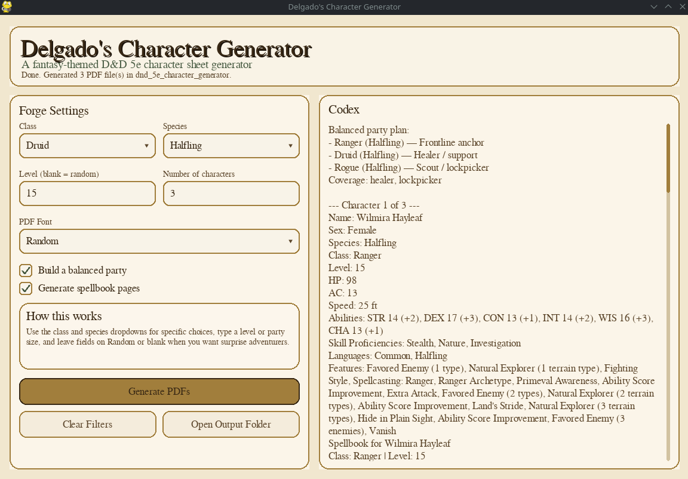

# GUI Usage (main.pyw)

The desktop GUI launcher lives at `main.pyw` and provides controls for:

- multi-select class preference chips (none selected = random)
- multi-select species preference chips (none selected = random)
- level dropdown (`Random`, `1`-`20`) and party size input
- PDF font selection
- party balance generation
- spellbook generation
- appended spell cards

## Screenshot



## Setup

1. Install Python 3.10+.
2. Install dependencies:

```bash
pip install -r requirements.txt
```

## Run On Linux

From the project folder:

```bash
python3 main.pyw
```

If your distro does not map `.pyw` to Python automatically, use:

```bash
python3 main.pyw
```

## Run On macOS

From Terminal in the project folder:

```bash
python3 main.pyw
```

## Run On Windows

From Command Prompt or PowerShell in the project folder:

```powershell
py main.pyw
```

You can also double-click `main.pyw` in Explorer if `.pyw` is associated with Python.

## Notes

- PDFs are written to the project root as `<Name>_Character_Sheet.pdf`.
- If a selected PDF font cannot be downloaded, the launcher falls back to a default font.
- The left settings pane is scrollable when window height is constrained; action buttons remain anchored at the bottom.
- The GUI does not replace CLI usage; `main.py` remains the standalone command-line entrypoint.
